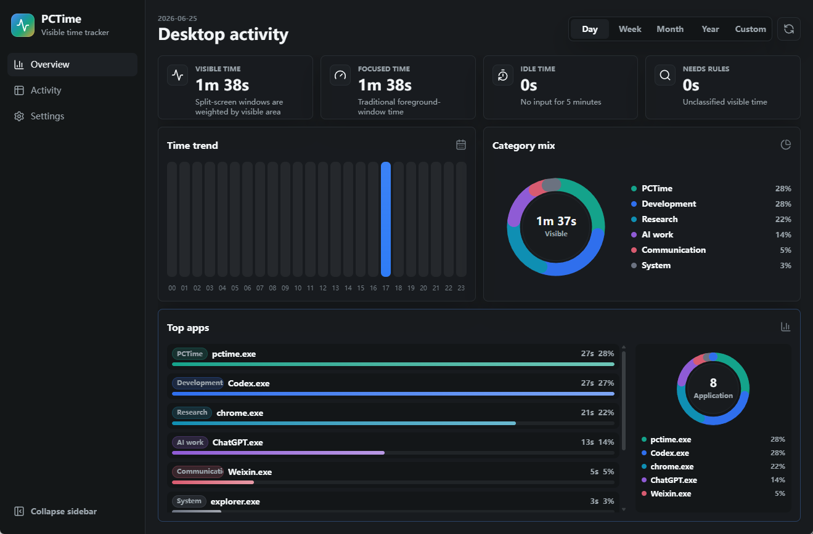
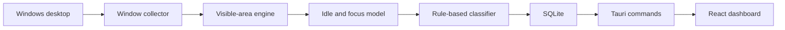

# PCTime

Visible-window desktop time tracking for split-screen work.

[简体中文](README.zh-CN.md) · [Architecture](docs/ARCHITECTURE.md)

PCTime is a local-first desktop time tracker that measures what is actually visible on your screen, not only the foreground window. It is designed for modern desktop workflows: code on one side, ChatGPT or docs on the other, a game or video partly visible, and multiple windows tiled across one monitor.

## Screenshot



## Why It Exists

Most desktop time trackers assign time to the focused or foreground window. That is useful, but it misses a common reality: people often keep several windows visible at the same time.

Example:

- Left half of the screen: Codex, VS Code, or another editor
- Right half of the screen: browser, ChatGPT, documentation, video, or a game
- Both windows are visible during the same second

A foreground-window tracker can usually give that second to only one app. PCTime enumerates visible top-level windows, subtracts areas covered by higher windows, calculates visible area, and distributes time by visible share.

If two windows each occupy half of the screen for one second, each gets roughly 0.5 seconds of visible time. PCTime also stores focus time separately so traditional foreground-window behavior can still be compared.

## Current Status

PCTime is a Windows-first MVP. It is already useful for testing the core idea, but it is not a finished commercial tracker.

Implemented:

- Tauri 2 desktop app
- Rust Windows collector
- visible-area weighting for tiled and overlapping windows
- focus time for comparison with classic trackers
- idle detection
- local SQLite storage
- rule-based local categorization
- day, week, month, year, and custom time ranges
- dashboard charts for time trend, category share, app ranking, and app share
- detailed analysis tables
- light and dark themes
- English and Simplified Chinese UI
- startup-at-login toggle on Windows
- close-to-tray mode with a Windows tray restore shortcut

Planned:

- editable category rules
- browser extension for exact URL and domain classification
- packaged release workflow
- ActivityWatch import
- macOS and Linux collectors
- optional local suggestions for unknown apps

## What PCTime Can and Cannot Know

PCTime can detect which windows are visible, how much area each visible window occupies, whether a window is focused, the window title, process name, process path, and idle state.

PCTime does not read pixels, take screenshots, run OCR, or inspect private content inside apps. It does not know the exact browser tab URL unless that information appears in the window title or a future browser extension provides it.

Unknown software is intentionally classified as `Unclassified`. The project should be conservative by default, then let users teach it their own rules.

## How It Works



PCTime stores two related models:

- **Visible time**: sample duration multiplied by each window's visible share.
- **Focus time**: sample duration assigned to the foreground window.

Visible time is the main differentiator. Focus time remains useful for comparison.

## Dashboard

The app is intentionally simple:

- **Overview**: high-level metrics, time trend, category donut, top app ranking, app share chart.
- **Analysis**: category and application details for the selected time range.
- **Settings**: language, theme, startup, close behavior, storage path, storage size, and performance notes.

Supported time filters:

- Day
- Week
- Month
- Year
- Custom start and end dates

## Data and Privacy

PCTime is local-first. The core tracker does not require an account or network connection.

Default database location:

```text
pctime-data/pctime.sqlite3
```

The app first tries to store the database next to the executable. If that location is read-only, it falls back to the user app data directory and shows the actual path in Settings.

## Performance

The collector samples once per second. Each sample stores small text and timing fields in SQLite.

The Settings page shows:

- database path
- database size
- total row count
- estimated daily storage
- sample interval
- idle threshold

The goal is to stay light enough for low-end PCs. Future versions can add a power-saving mode with a longer sample interval.

## Development

Requirements:

- Windows
- Node.js
- Rust
- Tauri prerequisites

Install dependencies:

```powershell
npm install
```

Run in development:

```powershell
npm run tauri dev
```

Build the frontend:

```powershell
npm run build
```

Check and test Rust:

```powershell
cd src-tauri
cargo check
cargo test
```

## Project Structure

```text
src/                   React UI
src-tauri/src/          Rust collector, storage, commands
src-tauri/src/collector Windows-specific and fallback collectors
src-tauri/icons/        App icons
docs/                   Architecture documentation
```

## License

MIT. See [LICENSE](LICENSE).
