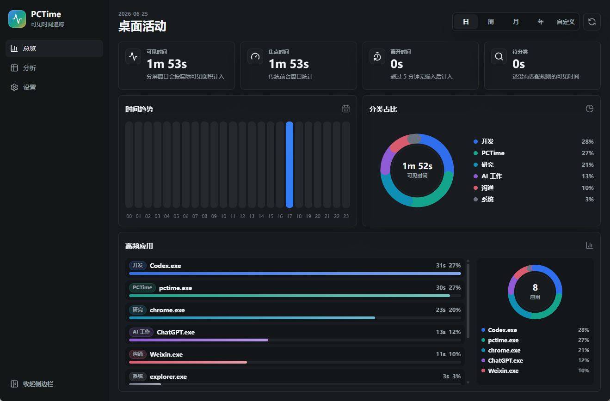
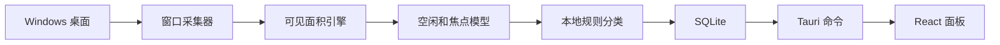

# PCTime

一个面向分屏工作的可见窗口时间追踪器。

[English](README.md) · [架构说明](docs/ARCHITECTURE.zh-CN.md)

PCTime 是一个本地优先的桌面时间统计软件。它统计的不是“当前聚焦窗口”这一件事，而是屏幕上实际可见的窗口。它适合现在很常见的工作方式：左边写代码，右边看 ChatGPT、文档、网页、视频，甚至一边工作一边让游戏或其它窗口露在屏幕上。

## 界面截图



## 为什么做它

很多桌面时间统计软件主要依赖前台窗口。这个模型很简单，但遇到分屏就会失真。

例如：

- 屏幕左侧是 Codex、VS Code 或其它编辑器
- 屏幕右侧是浏览器、ChatGPT、文档、视频或游戏
- 同一秒内两个窗口都在屏幕上可见

传统的前台窗口统计通常只能把这一秒算给其中一个软件。PCTime 会枚举当前可见的顶层窗口，扣掉被上层窗口遮挡的区域，计算每个窗口实际露出来的面积，再按可见面积分摊时间。

如果两个窗口各占半屏并持续一秒，它们会各自获得约 0.5 秒的可见时间。PCTime 同时也记录焦点时间，方便和传统前台窗口统计方式对比。

## 当前状态

PCTime 目前是 Windows 优先的 MVP。核心想法已经可以验证，但还不是一个完整商业化时间管理软件。

已经实现：

- Tauri 2 桌面应用
- Rust Windows 采集核心
- 分屏和窗口遮挡下的可见面积加权统计
- 焦点时间统计，方便和传统统计方式对比
- 空闲检测
- 本地 SQLite 存储
- 本地规则分类
- 日、周、月、年、自定义时间范围
- 时间趋势、分类占比、应用排行、应用占比等图表
- 详细分析表格
- 浅色和深色主题
- 简体中文和英文界面
- Windows 开机自启动开关
- 关闭到托盘模式，并可点击 Windows 托盘图标恢复

计划实现：

- 用户可编辑的分类规则
- 浏览器扩展，用于精确识别 URL 和域名
- 正式安装包和发布流程
- ActivityWatch 数据导入
- macOS 和 Linux 采集器
- 对未知应用的本地建议能力

## 能知道什么，不能知道什么

PCTime 可以知道哪些窗口在屏幕上可见、每个窗口露出多少面积、哪个窗口是焦点窗口、窗口标题、进程名、进程路径以及电脑是否空闲。

PCTime 不读取屏幕像素，不截图，不做 OCR，也不会解析应用窗口里的隐私内容。它不会知道浏览器具体打开了哪个 URL，除非 URL 出现在窗口标题里，或者未来浏览器扩展主动提供这些信息。

未知软件会保守地归为 `Unclassified`。这个项目不应该靠瞎猜来分类，而应该让用户通过规则把自己的软件教给它。

## 工作原理



PCTime 会保存两类时间：

- **可见时间**：采样时间乘以窗口可见面积占比。
- **焦点时间**：只有当前前台窗口获得的时间。

可见时间是 PCTime 的核心特点。焦点时间用于对照传统软件的统计逻辑。

## 面板

应用界面尽量保持简洁：

- **总览**：关键指标、时间趋势、分类圆环图、高频应用排行、应用占比。
- **分析**：分类和应用的详细表格。
- **设置**：语言、主题、开机自启动、关闭行为、数据路径、存储大小和性能信息。

时间筛选支持：

- 日
- 周
- 月
- 年
- 自定义开始和结束日期

## 数据和隐私

PCTime 是本地优先软件。核心统计不需要账号，也不需要网络连接。

默认数据库位置：

```text
pctime-data/pctime.sqlite3
```

应用会优先把数据库放在可执行文件旁边。如果该位置不可写，会回退到用户应用数据目录，并在设置页面展示实际路径。

## 性能

采集器默认每秒采样一次。每次采样只会向 SQLite 写入少量文本和时间字段。

设置页面会展示：

- 数据库路径
- 数据库大小
- 总记录数
- 预估每日存储量
- 采样间隔
- 空闲阈值

目标是让低配置电脑也能长期运行。后续可以增加更省电的低频采样模式。

## 开发

要求：

- Windows
- Node.js
- Rust
- Tauri 依赖环境

安装依赖：

```powershell
npm install
```

本地开发运行：

```powershell
npm run tauri dev
```

构建前端：

```powershell
npm run build
```

检查和测试 Rust：

```powershell
cd src-tauri
cargo check
cargo test
```

## 项目结构

```text
src/                   React 界面
src-tauri/src/          Rust 采集、存储和命令
src-tauri/src/collector Windows 采集器和 fallback 采集器
src-tauri/icons/        应用图标
docs/                   架构文档
```

## 许可证

MIT。见 [LICENSE](LICENSE)。
