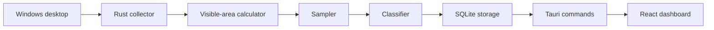

# Architecture

PCTime is split into a Rust collection core and a React dashboard hosted by Tauri.

The important design choice is that the tracker measures visible windows, not just the foreground window. This lets it describe split-screen desktop use more accurately than a classic active-window logger.

## Runtime Flow



## Rust Modules

`src-tauri/src/collector`

Platform collection layer. On Windows, the collector walks top-level windows in z-order and reads the title, process id, process path, focus state, and extended frame bounds.

`src-tauri/src/visibility.rs`

Computes actual visible area. It processes windows in z-order and subtracts rectangles already covered by windows above the current one.

`src-tauri/src/sampler.rs`

Coordinates each sampling tick. It checks idle state, collects windows, calculates visible shares, classifies each window, and writes a batch of sample rows.

`src-tauri/src/classifier.rs`

Local rule-based categorization using process names, window titles, and process paths. The classifier is intentionally conservative: unknown apps stay `Unclassified` until rules are added.

`src-tauri/src/storage.rs`

SQLite schema, inserts, migrations, and dashboard aggregation queries. It also refreshes old `Unclassified` rows when the built-in classifier gains new rules.

`src-tauri/src/commands.rs`

Tauri commands called by the React frontend for dashboard data, settings data, app version, startup-at-login, and close-to-tray configuration.

`src-tauri/src/models.rs`

Shared serializable models used across Rust commands and React.

## Visible-Time Model

Each sample tick receives a duration, currently one second. For every visible window, PCTime stores:

- visible area in pixels
- visible share of the desktop
- weighted visible milliseconds
- focus milliseconds
- idle flag

The visible-time formula is:

```text
weighted_visible_ms = sample_duration_ms * visible_share
```

Focus time is stored separately:

```text
focus_ms = sample_duration_ms when the window is foreground, otherwise 0
```

This makes it possible to answer two different questions:

- **What was visible on screen?** Use visible time.
- **What window had keyboard focus?** Use focus time.

## Split-Screen Example

When two windows are tiled side by side and neither covers the other:

```text
Codex visible share  = 0.50
Chrome visible share = 0.50
sample duration      = 1000 ms
```

Stored result:

```text
Codex visible time  = 500 ms
Chrome visible time = 500 ms
foreground app      = receives 1000 ms focus time
```

This is the core behavior that makes PCTime different from foreground-only trackers.

## Storage Model

The main table is `samples`. Each row represents a sampled window slice:

- `sampled_at`
- `duration_ms`
- `app_name`
- `window_title`
- `process_path`
- `category`
- `visible_area`
- `visible_share`
- `weighted_ms`
- `focus_ms`
- `is_focused`
- `is_idle`

Dashboard queries aggregate rows by time range. The timeline endpoint also returns the top apps for each bucket so the UI can show hover details for each hour, day, month, or year bucket.

## Frontend Shape

The React app has three main surfaces:

- `Overview`: visual dashboard with metrics, time trend, category donut, application ranking, and app share chart.
- `Analysis`: detailed category and app breakdowns for deeper inspection.
- `Settings`: language, theme, software updates, startup, close behavior, data location, and lightweight performance/storage information.

The UI stores language, theme, selected range, custom dates, and sidebar state in local storage.

## Updates

The app uses a lightweight GitHub Releases check instead of a hosted update server. The frontend reads the app version from a Tauri command, fetches the latest public release from GitHub, compares semantic versions, and links to the matching Windows x64 MSI asset when a newer version exists.

Automatic checking is rate-limited in local storage to roughly once per day. Manual checking remains available from Settings. This is detection and download guidance, not a signed silent installer.

## Internationalization

The current UI uses a small local dictionary in `src/App.tsx` for English and Simplified Chinese. Category display names are localized in the frontend while canonical category names remain stable in the database.

This keeps existing rows readable even when the user switches languages.

## Limits

PCTime does not inspect screen pixels. It does not take screenshots, run OCR, or understand the inside of an application window.

Classification is currently rule-based. For browsers, exact URL/domain classification needs a browser extension. Until then, browser classification depends on process name and window title.

## Roadmap Notes

Good next architecture steps:

- user-editable rules stored in SQLite
- browser extension metadata bridge
- import pipeline for ActivityWatch events
- platform-specific collectors for macOS and Linux
- optional local suggestions for unknown apps
