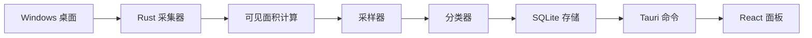

# 架构说明

PCTime 由 Rust 采集核心和 Tauri 承载的 React 面板组成。

最关键的设计选择是：它统计可见窗口，而不是只统计前台窗口。这样在分屏和多窗口使用场景下，数据会比传统 active-window 记录器更接近真实桌面使用情况。

## 运行流程



## Rust 模块

`src-tauri/src/collector`

平台采集层。Windows 采集器会按照 z-order 遍历顶层窗口，并读取窗口标题、进程 id、进程路径、焦点状态和扩展窗口边界。

`src-tauri/src/visibility.rs`

计算窗口实际可见面积。它按照窗口层级处理窗口，并从当前窗口中扣掉已经被更上层窗口覆盖的矩形区域。

`src-tauri/src/sampler.rs`

负责每一次采样。它会检查空闲状态、收集窗口、计算可见占比、分类窗口，并把一批样本写入数据库。

`src-tauri/src/classifier.rs`

本地规则分类器。它根据进程名、窗口标题和进程路径分类。分类器会保持保守，无法确认的软件保留为 `Unclassified`。

`src-tauri/src/storage.rs`

SQLite 表结构、写入、迁移和面板聚合查询。内置分类规则更新后，它也会刷新旧的 `Unclassified` 记录。

`src-tauri/src/commands.rs`

React 前端调用的 Tauri 命令，包括面板数据、设置数据、开机自启动和关闭到托盘配置。

`src-tauri/src/models.rs`

Rust 命令和 React 前端共用的序列化模型。

## 可见时间模型

每一次采样当前默认为一秒。对每个可见窗口，PCTime 会保存：

- 可见面积像素
- 桌面可见占比
- 加权可见毫秒数
- 焦点毫秒数
- 是否空闲

可见时间公式：

```text
weighted_visible_ms = sample_duration_ms * visible_share
```

焦点时间公式：

```text
focus_ms = 窗口为前台窗口时的 sample_duration_ms，否则为 0
```

这让软件可以回答两个不同问题：

- **屏幕上实际露出了什么？** 看可见时间。
- **键盘焦点在哪个窗口？** 看焦点时间。

## 分屏示例

当两个窗口左右分屏，且互不遮挡：

```text
Codex 可见占比  = 0.50
Chrome 可见占比 = 0.50
采样时长        = 1000 ms
```

写入结果：

```text
Codex 可见时间  = 500 ms
Chrome 可见时间 = 500 ms
前台软件        = 获得 1000 ms 焦点时间
```

这就是 PCTime 区别于只看前台窗口的软件的核心能力。

## 存储模型

主表是 `samples`。每一行表示一个被采样到的窗口切片：

- `sampled_at`
- `duration_ms`
- `app_name`
- `window_title`
- `process_path`
- `category`
- `visible_area`
- `visible_share`
- `weighted_ms`
- `focus_ms`
- `is_focused`
- `is_idle`

面板查询会按时间范围聚合这些记录。时间趋势接口还会返回每个时间桶里的 Top 应用，这样前端 hover 时可以展示该时段的主要应用和占比。

## 前端结构

React 应用目前有三个主要界面：

- `Overview`：图形化总览，包括指标、时间趋势、分类圆环图、应用排行和应用占比。
- `Analysis`：更细的分类和应用明细。
- `Settings`：语言、主题、开机自启动、关闭行为、数据位置和性能/存储信息。

语言、主题、时间范围、自定义日期和侧边栏状态会保存在本地 localStorage。

## 多语言

当前 UI 使用 `src/App.tsx` 里的轻量本地字典支持英文和简体中文。数据库里保存稳定的英文分类名，前端负责把分类显示为当前语言。

这样用户切换语言后，旧数据仍然可以正常展示。

## 限制

PCTime 不检查屏幕像素，不截图，不 OCR，也不理解窗口内部内容。

分类目前基于规则。浏览器想要准确识别 URL 和域名，需要后续浏览器扩展支持。在扩展完成前，浏览器分类主要依赖进程名和窗口标题。

## 后续架构方向

值得优先做的方向：

- SQLite 中保存用户自定义分类规则
- 浏览器扩展元数据桥接
- ActivityWatch 数据导入
- macOS 和 Linux 平台采集器
- 对未知应用提供可选的本地分类建议
